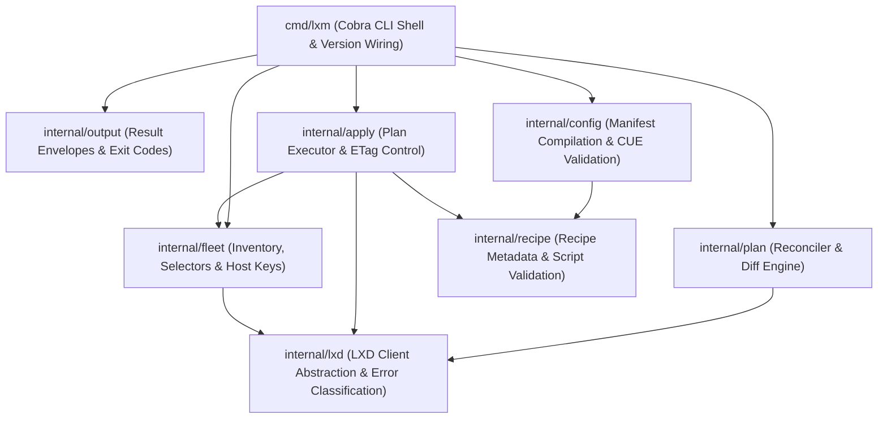
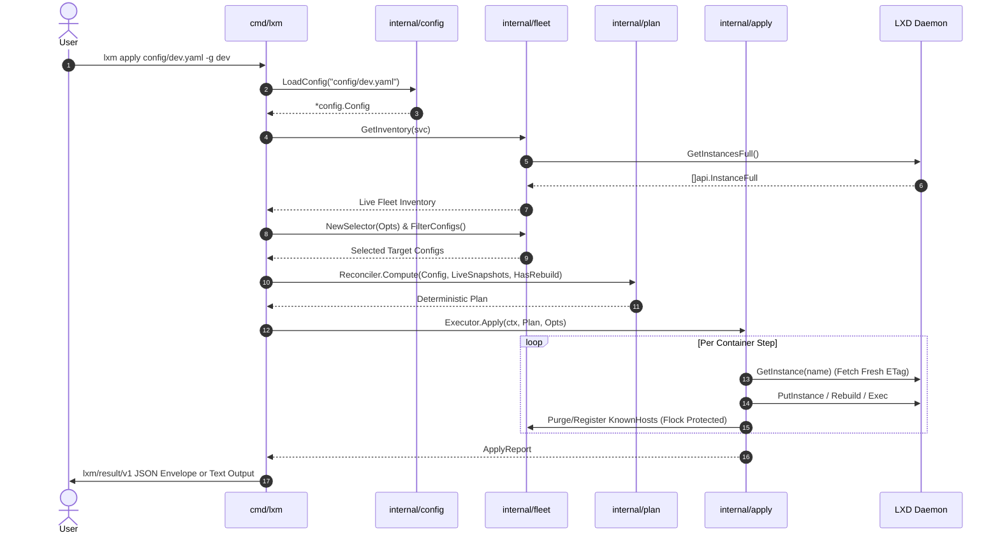

# lxm v2 Architecture Specification

## 1. Overview & Design Principles

`lxm` is a declarative, infrastructure-as-code fleet management tool for LXD containers. It allows operators to define desired fleet states in structured YAML manifests, compile them into deterministic reconciliation plans, and execute mutations safely and idempotently.

The architecture is guided by nine foundational design principles:

1. **Reconciliation as a Control Loop**: `lxm` computes pure, deterministic diffs (**Plans**) comparing desired state (manifests) against live infrastructure (LXD daemon). Mutation occurs solely through a thin, isolated executor.
2. **The Plan as a First-Class Artifact**: Diffs are materialized, serializable (`--format json`), and machine-readable. Previews (`lxm plan`) and execution (`lxm apply`) consume identical plan objects.
3. **Machine Interface First**: Every CLI command (excluding interactive TTY sessions) outputs structured `lxm/result/v1` JSON envelopes on `--format json`. Exit codes are strictly categorized (0–7).
4. **Compiled Manifests**: Source YAML manifests undergo a deterministic 6-step compilation pipeline. All inheritance, directives (`remove`, `replace`), variables (`vars:`), and template parameters (`{{ .Env.* }}`) are fully resolved before plan computation.
5. **Safety by Default**: Dry-run previewing is comprehensive. Destructive steps (e.g. `recreate` fallbacks, snapshot purges) require explicit `--force` flags. Automatic snapshots precede recipe execution.
6. **Security by Default**: SSH host key verification is enforced via a tool-managed `known_hosts` file with advisory file locking (`syscall.Flock`). Sudo passwordless access and SSH key injection are strictly opt-in.
7. **Modular Domain Packages**: Domain logic resides within isolated, testable packages (`config`, `plan`, `apply`, `fleet`, `recipe`, `lxd`, `output`).
8. **Selectable & Bounded Parallel Fleet Operations**: Targeting uses expressive selector algebra (union across groups, intersection with names). Fleet execution is bounded and attributable per-container.
9. **Leverage Quality Open Source**: Built using canonical Go libraries (`cobra`, `yaml.v3`, LXD client SDK `github.com/canonical/lxd/client`, `cuelang.org/go`, `x/term`, `errgroup`).

---

## 2. Component Topology & Package Architecture

### Package Responsibilities

* **`cmd/lxm`**: Serves as the CLI entry point and wiring layer. Parses cobra flags, wires signal contexts (`signal.NotifyContext`), handles version stamping (`version`, `commit`, `date`), routes commands, and emits structured results to `internal/output`.
* **`internal/config`**: Owns manifest loading, presence-wins scalar merging, recursive struct merging, list inheritance directives (`remove`, `replace`), template parameter expansion (`{{ .Env.* }}`, `{{ .Vars.* }}`), and CUE schema validation against `#LXM_AUTHORING` and `#LXM_RESOLVED`.
* **`internal/plan`**: Implements the reconciliation diff engine. Compares compiled `Manifest` objects against LXD container states (`api.InstanceFull`) to generate deterministic `Plan` objects comprising actionable `Step` items (`create`, `update`, `recreate`, `delete`, `start`, `stop`).
* **`internal/apply`**: Executes computed `Plan` steps against the LXD daemon. Enforces Optimistic Concurrency Control (OCC) via single-step ETag discipline, manages automatic snapshots, executes recipes, handles operation cancellation (`op.Cancel()`), and purges host keys on container deletion/recreate.
* **`internal/fleet`**: Provides fleet inventory retrieval via `GetInstancesFull` (single round-trip), selector evaluation (OR across repeated `-g`/`--group` flags, AND with `--name`), `KnownHostsManager` with advisory file locking (`syscall.Flock`), and `--prune` orphan garbage collection.
* **`internal/recipe`**: Loads script bodies and metadata files (`lxm/recipe/v1`), validates POSIX environment variable names, executes script logic inside containers, and manages path-qualified recipe hash metadata (`user.lxm.recipe.<cleaned-relative-path>.hash`).
* **`internal/lxd`**: Wraps the canonical LXD client SDK (`lxd.InstanceService`), exposes operation handles, provides `FakeInstanceServer` for isolated unit/integration testing, and classifies LXD HTTP/socket errors into exit codes (`ClassifyLXDError`).
* **`internal/output`**: Standardizes stdout/stderr emission using the `lxm/result/v1` JSON envelope format (`schema`, `command`, `ok`, `target`, `plan`, `results`, `warnings`, `errors`, `exit_code`) and enforces the 1-to-1 exit code to error code mapping catalog (`ExitCodeToErrorCode`).

---

## 3. Dataflow & Execution Lifecycle

---

## 4. Key Architectural Mechanisms

### 4.1 Two-Schema CUE Boundary
Configuration validation is divided into two distinct CUE schemas residing in `internal/config/schemas/`:
* **`#LXM_AUTHORING` (`v2.cue`)**: Used for pre-compilation validation and IDE schema export. Accepts user shorthands (string/map mounts, recipe string lists, `~` tilde sources, `vars:` declarations).
* **`#LXM_RESOLVED` (`v2.cue`)**: The strict, authoritative security gate applied to compiled manifests. Rejects all shorthands, directives, and unknown fields. Enforces absolute source paths (`source: =~"^/"`) and clean, non-system mount destinations (`#CleanMountPath`).

### 4.2 Single-Step ETag Discipline & OCC
To prevent stomping concurrent external modifications:
1. Plan computation records the plan-time ETag.
2. Before the first mutating operation of a step, the executor verifies the ETag matches the plan-time ETag. If drift occurred, execution halts with exit code 4 (`retryable: true`).
3. For multi-operation steps (e.g. snapshot -> update -> write recipe hash), the executor fetches a fresh ETag immediately prior to each `PUT`/`PATCH` call.

### 4.3 Advisory File Locking (`syscall.Flock`)
Concurrent fleet operations and parallel SSH connections manipulate `~/.config/lxm/known_hosts`. All reads, `ssh-keyscan` registrations, and `ssh-keygen -R` purges are serialized using `syscall.Flock` on `~/.config/lxm/known_hosts.lock`.

### 4.4 Operation Cancellation & Interactive Carve-Out
* **Cancellation**: Long-running LXD operations are bound to `signal.NotifyContext`. Upon receiving `SIGINT` (Ctrl+C) or `SIGTERM`, the executor invokes `op.Cancel()` on active LXD operations and logs interrupted containers.
* **Interactive Carve-Out**: `lxm shell` and `lxm ssh` attach directly to raw TTY terminal streams. Passing `--format json` to these commands is explicitly rejected with exit code 2.
