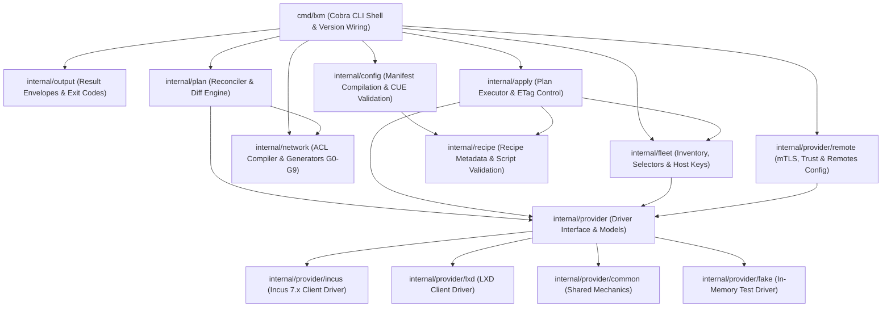
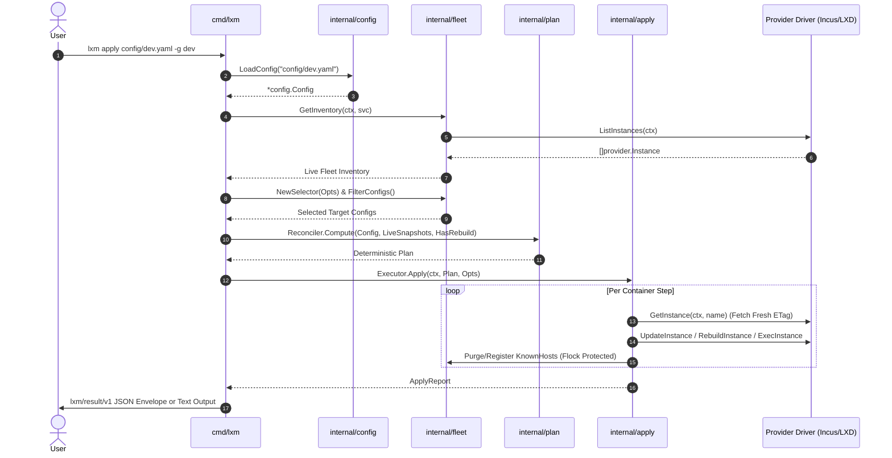

# lxm v2 Architecture Specification

## 1. Overview & Design Principles

`lxm` is a declarative, infrastructure-as-code fleet management tool for Incus and LXD container and virtual machine fleets. It allows operators to define desired fleet states in structured YAML manifests, compile them into deterministic reconciliation plans, and execute mutations safely and idempotently across Incus and LXD daemons.

The architecture is guided by nine foundational design principles:

1. **Reconciliation as a Control Loop**: `lxm` computes pure, deterministic diffs (**Plans**) comparing desired state (manifests) against live infrastructure (Incus / LXD daemon). Mutation occurs solely through a thin, isolated executor.
2. **The Plan as a First-Class Artifact**: Diffs are materialized, serializable (`--format json`), and machine-readable. Previews (`lxm plan`) and execution (`lxm apply`) consume identical plan objects.
3. **Machine Interface First**: Every CLI command (excluding interactive TTY sessions) outputs structured `lxm/result/v1` JSON envelopes on `--format json`. Exit codes are strictly categorized (0–7).
4. **Compiled Manifests**: Source YAML manifests undergo a deterministic 6-step compilation pipeline. All inheritance, directives (`remove`, `replace`), variables (`vars:`), and template parameters (`{{ .Env.* }}`) are fully resolved before plan computation.
5. **Safety by Default**: Dry-run previewing is comprehensive. Destructive steps (e.g. `recreate` fallbacks, snapshot purges) require explicit `--force` flags. Automatic snapshots precede recipe execution.
6. **Security by Default**: SSH host key verification is enforced via a tool-managed `known_hosts` file with advisory file locking (`syscall.Flock`). Sudo passwordless access and SSH key injection are strictly opt-in.
7. **Modular Domain Packages**: Domain logic resides within isolated, testable packages (`config`, `plan`, `apply`, `fleet`, `recipe`, `provider`, `output`).
8. **Selectable & Bounded Parallel Fleet Operations**: Targeting uses expressive selector algebra (union across groups, intersection with names). Fleet execution is bounded and attributable per-container.
9. **Leverage Quality Open Source**: Built using canonical Go libraries (`cobra`, `yaml.v3`, Incus Go SDK `github.com/lxc/incus/v7/client`, LXD client SDK `github.com/canonical/lxd/client`, `cuelang.org/go`, `x/term`, `errgroup`).
10. **Tagged & Enumerable Ownership**: Every object `lxm` creates — instances, networks, ACLs, devices, storage volumes, snapshots, images — is tagged with `user.lxm.managed: "true"` (plus provenance keys where useful), and every tagged object is discoverable through a single inventory surface. Ownership is marker-based, never name-based (see §4.5).

---

## 2. Component Topology & Package Architecture



### Package Responsibilities

* **`cmd/lxm`**: Serves as the CLI entry point and wiring layer. Parses cobra flags, wires signal contexts (`signal.NotifyContext`), handles version stamping (`version`, `commit`, `date`), routes commands (including `lxm remote`, `lxm doctor`, `lxm vswitch gc`), and emits structured results to `internal/output`.
* **`internal/config`**: Owns manifest loading, presence-wins scalar merging, recursive struct merging, list inheritance directives (`remove`, `replace`), template parameter expansion (`{{ .Env.* }}`, `{{ .Vars.* }}`), remote routing (`provider`, `remote`, `target`, `project`, `remotes`), and CUE schema validation against `#LXM_AUTHORING` and `#LXM_RESOLVED`.
* **`internal/network`**: Implements the deterministic network compilation and validation engine. Evaluates fleet-scoped virtual switch unions, compiles group-based `network_policy` into network ACLs via generators (G0 intra-switch rules, G1–G2 intra-group, G3–G4 inter-group allow, G5–G6 stateful return, G7 internet egress, G8 internal reject with multi-source DNS carveouts, G9 host gateway port guards), performs CIDR prefix decomposition, and validates instance-NIC integrity.
* **`internal/provider`**: Declares the unified `Driver` interface combining instance, network, storage, image, cluster, and project services with method scoping (`UseProject`, `UseTarget`).
* **`internal/provider/incus`**: Implements `provider.Driver` wrapping the canonical Incus 7.x SDK (`github.com/lxc/incus/v7/client`).
* **`internal/provider/lxd`**: Implements `provider.Driver` wrapping the canonical LXD client SDK (`github.com/canonical/lxd/client`).
* **`internal/provider/common`**: Single-sourced cross-provider mechanics shared by every driver — error/ETag classification, `boot.mode` ↔ `security.secureboot`/`security.csm` translation (VM-gated), byte-size parsing, user-env/UID resolution, IPv4 extraction, async-operation waiting, and interactive-terminal exec. Keeps the LXD and Incus drivers as thin SDK mappings.
* **`internal/provider/fake`**: `FakeDriver`, the universal in-memory `provider.Driver` used by the entire test suite (instances, snapshots, volumes, networks, ACLs, images, cluster, projects) with thread safety and seeding helpers.
* **`internal/provider/remote`**: Manages remote endpoints in `~/.config/lxm/remotes.yaml` with file locking (`remotes.lock`), generates client mTLS certificate pairs (`client.crt`/`client.key`), provides trust-token enrollment, and resolves target drivers dynamically.
* **`internal/plan`**: Implements the reconciliation diff engine. Compares compiled `Manifest` objects against provider instance and network states to generate deterministic `Plan` objects comprising actionable `Step` items (`create`, `update`, `recreate`, `delete`, `start`, `stop`).
* **`internal/apply`**: Executes computed `Plan` steps against the provider driver. Enforces Optimistic Concurrency Control (OCC) via single-step ETag discipline, manages automatic snapshots, executes recipes, handles operation cancellation (`op.Cancel()`), orchestrates network creation with member staging and polling, and purges host keys on container deletion/recreate.
* **`internal/fleet`**: Provides fleet inventory retrieval, selector evaluation (OR across repeated `-g`/`--group` flags, AND with `--name`), `KnownHostsManager` with advisory file locking (`syscall.Flock`), and `--prune` orphan garbage collection.
* **`internal/recipe`**: Loads script bodies and metadata files (`lxm/recipe/v1`), validates POSIX environment variable names, executes script logic inside containers, and manages path-qualified recipe hash metadata (`user.lxm.recipe.<cleaned-relative-path>.hash`).
* **`internal/output`**: Standardizes stdout/stderr emission using the `lxm/result/v1` JSON envelope format (`schema`, `command`, `ok`, `target`, `plan`, `results`, `warnings`, `errors`, `exit_code`) and enforces the 1-to-1 exit code to error code mapping catalog (`ExitCodeToErrorCode`).

---

## 3. Dataflow & Execution Lifecycle



---

## 4. Key Architectural Mechanisms

### 4.1 Two-Schema CUE Boundary
Configuration validation is divided into two distinct CUE schemas residing in `internal/config/schemas/`:
* **`#LXM_AUTHORING` (`v2.cue`)**: Used for pre-compilation validation and IDE schema export. Accepts user shorthands (string/map mounts, recipe string lists, `~` tilde sources, `vars:` declarations).
* **`#LXM_RESOLVED` (`v2.cue`)**: The strict, authoritative security gate applied to compiled manifests. Rejects all shorthands, directives, and unknown fields. Enforces absolute source paths (`source: =~"^/"`) and clean, non-system mount destinations (`#CleanMountPath`).

### 4.2 Single-Step ETag Discipline & OCC
To prevent stomping concurrent external modifications:
1. Plan computation records the plan-time ETag.
2. Before the first mutating operation of a step, the executor verifies the ETag matches the plan-time ETag. If drift occurred, execution halts with exit code 4 (`retryable: true`).
3. For multi-operation steps (e.g. snapshot -> update -> write recipe hash), the executor fetches a fresh ETag immediately prior to each `PUT`/`PATCH` call.

### 4.3 Advisory File Locking (`syscall.Flock`)
Concurrent fleet operations and parallel SSH connections manipulate `~/.config/lxm/known_hosts`. All reads, `ssh-keyscan` registrations, and `ssh-keygen -R` purges are serialized using `syscall.Flock` on `~/.config/lxm/known_hosts.lock`.

### 4.4 Operation Cancellation & Interactive Carve-Out
* **Cancellation**: Long-running LXD operations are bound to `signal.NotifyContext`. Upon receiving `SIGINT` (Ctrl+C) or `SIGTERM`, the executor invokes `op.Cancel()` on active LXD operations and logs interrupted containers.
* **Interactive Carve-Out**: `lxm shell` and `lxm ssh` attach directly to raw TTY terminal streams. Passing `--format json` to these commands is explicitly rejected with exit code 2.

### 4.5 Ownership Markers & Unified Inventory

`lxm` distinguishes *its own* resources from foreign ones via a single ownership predicate — the
`user.lxm.managed: "true"` config key — never via naming. Name conventions (`lxm-<vswitch>` for
ACLs, `<instance>-<name>` for managed volumes, `user.lxm.snap.` for snapshots, canonical image
aliases) are ergonomic labels only; the marker is the authority for adopt/ignore/GC decisions.

Current tagging status across every resource class:

| Resource | Marker today | Enumerated by |
| :-- | :-- | :-- |
| Instances (containers/VMs) | `user.lxm.managed=true` ✓ | `lxm list` (`internal/fleet/inventory.go`) |
| Networks (vswitch bridges) | `user.lxm.managed=true` ✓ | plan reconcile only |
| Network ACLs (`lxm-<name>`) | `user.lxm.managed=true` ✓ | plan reconcile only |
| NIC devices | `user.lxm.managed=true` in the legacy path (`internal/lxm/devices.go`); **omitted in the plan path** (`internal/plan/plan.go`) | — |
| Mount devices | **no marker** | — |
| Storage volumes (disks) | **no marker** (`config: {size}` only) | — |
| Snapshots | name-prefix only (`user.lxm.snap.<inst>-<ts>`) | `lxm snapshot gc --prefix` |
| Images | canonical alias only (`ubuntu/22.04`, `ubuntu/22.04/vm`) | — |

The principle decomposes into two requirements, both tracked as gaps until closed:

1. **Uniform tagging.** Every class must carry `user.lxm.managed=true` at creation. Outstanding gaps:
   storage volumes (closed by the deletion/lifecycle feature), mount devices, and the NIC-device
   marker in the plan path. Snapshots and images currently rely on prefix/alias identity; a decision
   on whether they need a config marker is deferred but recorded here.
2. **Unified enumeration.** One surface must list every tagged object by marker. Today `lxm list`
   covers instances only; networks, ACLs, volumes, snapshots, and images each require a distinct
   probe. The inventory surface (`internal/fleet`) is the designated home for a
   marker-keyed, cross-resource enumeration (e.g. `lxm list --all` or per-resource subcommands).

### 4.6 OVN Virtual Switching & Distributed Datapath Architecture

`lxm` supports two virtual switch backends via `vswitches:`: local Linux Bridges (`type: bridge`) and Open Virtual Network distributed overlay switches (`type: ovn`).

```mermaid
graph TD
    subgraph Host / Cluster Datapath
        VS[vswitches: declaration] --> Bridge[type: bridge - Linux Bridge]
        VS --> OVN[type: ovn - OVN Overlay Switch]
        Bridge --> L2Host[Host Namespace Gateway / Bridge Boundary]
        OVN --> Uplink[Parent Uplink Network: lxdbr0 / incusbr0]
        OVN --> Geneve[Distributed Geneve Tunnels across Cluster Nodes]
    end

    subgraph ACL Compiler Engine (internal/network)
        G0[G0: Intra-switch allow S_V -> S_V (OVN only)]
        G12[G1-G2: Intra-group mutual allow]
        G34[G3-G4: Inter-group direction-aware allow]
        G8[G8: Internal reject with /32 DNS carveouts]
        G9[G9: Host gateway non-DNS port guards]
    end

    OVN --> G0
    OVN --> G8
    OVN --> G9
```

1. **Datapath & ACL Filtering Differences**:
   * **Linux Bridge (`type: bridge`)**: ACLs attach at the boundary between the bridge and host OS namespace. Intra-bridge traffic bypasses the ACL filter (unfiltered L2). The bridge gateway is an IP alias on the host namespace; G8 rejects instance-to-host gateway traffic while preserving DHCP/DNS via provider baseline rules.
   * **OVN Overlay (`type: ovn`)**: Operates as a distributed OpenFlow logical switch spanning cluster nodes via Geneve tunnels. Because OVN evaluates ACLs on every logical switch port under a default-reject policy, intra-switch traffic would be blocked without explicit rules. `internal/network` emits **G0** intra-switch allow rules (`allow S_V → S_V`) for OVN virtual switches so instances on the same OVN switch communicate freely.
2. **DNS Resolver Derivation, Leak-Sealing & Host Gateway Protection**:
   * OVN virtual switches derive IPv4 DNS resolvers via a strict 4-step precedence chain in `internal/plan/network.go` (`deriveDNSResolvers`): explicit `VSwitch.DNSResolvers` → vswitch `config["dns.nameservers"]` → uplink parent `config["dns.nameservers"]` → uplink parent `ipv4.address` gateway (IPv4 only, filtered via `To4()`).
   * **G8** generates `/32` resolver carve-out rules permitting UDP/TCP port 53 for internal/RFC1918 resolvers while rejecting all other internal/RFC1918 traffic (public resolvers like `1.1.1.1` are permitted by the G7 wildcard and need no carveout).
   * On **`internet: false`** OVN networks, the compiler emits explicit port 53 (UDP & TCP) reject rules targeting derived upstream resolvers (skipping in-subnet resolvers so intra-subnet DNS resolution continues working). In OVN, the provider daemon maps `reject` to priority 400 (overriding its baseline priority 200 DNS allow), strictly sealing outbound DNS leaks.
   * **G9** port guards explicitly block non-DNS host ports (SSH, API listeners) on the gateway IP.
3. **Cluster Member Staging vs. OVN Creation Polling**:
   * For Linux Bridges (`type: bridge`) on multi-node clusters, the driver performs two-phase cluster member staging (`stageNetworkOnMembers`) with node-specific configurations before cluster-wide activation.
   * Distributed OVN overlay networks (`type: ovn`) are cluster-wide database objects and explicitly bypass per-member staging. Instead, the driver executes fail-closed polling to verify that newly created OVN networks transition out of the `Pending` state before any instance NIC devices are attached.
4. **Provider Capability Gating & Doctor Probing**:
   * Basic OVN capability is checked via `hasOVNSupport` (accepting `network_ovn`, `network_ovn_nat`, or `network_ovn_acl`). Policy-managed OVN virtual switches (`group:`) configure `security.acls`, which relies on `network_ovn_acl` and `network_acl` support in the provider daemon.
   * `lxm doctor` executes a unique, leak-free throwaway OVN network probe when an active IPv4 uplink bridge is present on the host to verify end-to-end OVS/OVN database connectivity.

