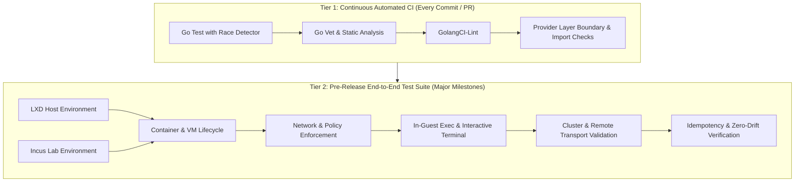
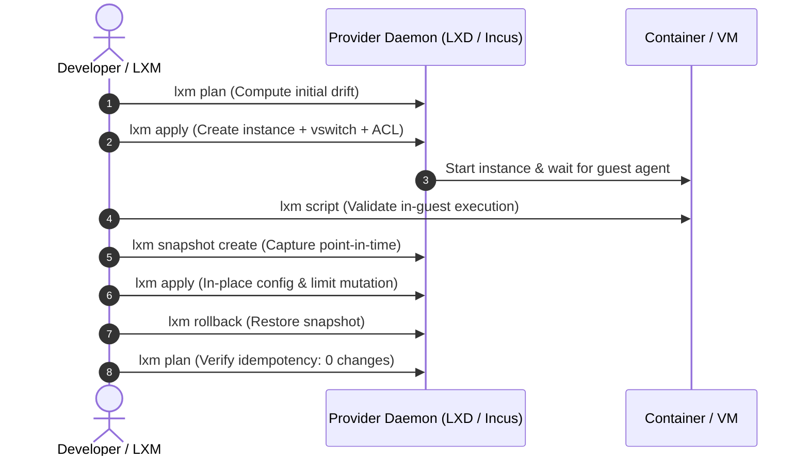
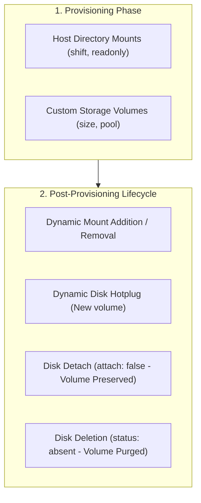

# LXM Testing Strategy & Verification Guide

This document defines the comprehensive testing strategy for **LXM**. It establishes the required test workflows and pre-release gates to validate multi-provider support across **Canonical LXD**, **Incus**, and future **OVN** distributed networking.

---

## 1. Testing Philosophy & Cadence

LXM employs a two-tier testing hierarchy. Because full end-to-end provisioning requires live hypervisors/daemons and kernel resources, exhaustive end-to-end tests are executed at major release milestones, while fast unit and static analysis gates run continuously.



### Testing Cadence
1. **Continuous (CI / Local Dev)**:
   - Executed on every pull request and commit.
   - 100% mocked via `internal/provider/fake` and `net/http/httptest`.
   - Completes in seconds.
2. **Pre-Release Milestone Gates**:
   - Executed prior to tagging releases or merging major architectural milestones.
   - Validates live reconciliation against both **Canonical LXD** and **Incus** daemons.

---

## 2. Multi-Provider Coverage Matrix

All core LXM features must be validated across the supported hypervisors and configuration permutations:

| Capability Area | Canonical LXD (6.x+) | Incus (6.x+) | OVN (Future / Staging) | Verification Method |
| :--- | :--- | :--- | :--- | :--- |
| **Container Creation & Update** | Supported | Supported | Supported | `lxm apply` + config mutation |
| **VM (UEFI Secureboot)** | Supported (`boot.mode`) | Supported (`security.secureboot`) | Supported | VM boot + agent handshake |
| **VM (UEFI NoSecureboot)** | Supported (`boot.mode`) | Supported (`security.secureboot=false`) | Supported | VM boot + agent handshake |
| **VM (Legacy BIOS / CSM)** | Supported (`boot.mode=bios`) | Supported (`security.csm=true`) | Supported | VM boot + agent handshake |
| **Host Directory Mounts** | Supported (`mounts`) | Supported (`mounts`) | Supported | In-guest file I/O & dynamic update |
| **Managed Storage Disks** | Supported (`disks`) | Supported (`disks`) | Supported | Custom pool volume allocation |
| **Disk Detach & Volume Delete** | Supported (`attach: false` / `status: absent`) | Supported | Supported | Device detachment & volume lifecycle |
| **VSwitch (Bridge)** | Supported (`bridge`) | Supported (`bridge`) | N/A | Bridge creation & IPAM |
| **VSwitch (OVN)** | Supported | Supported | Supported (`ovn`) | Uplink attach & L3 routing |
| **Network ACLs / Policies** | Supported (`network_acl`) | Supported (`network_acl`) | Supported | Kernel packet drop & ping test |
| **In-Guest Script Execution** | Supported | Supported | Supported | `lxm script` exit codes |
| **Interactive Terminal Raw Mode** | Supported | Supported | Supported | `lxm shell` window resize / signals |
| **Remote HTTPS / mTLS** | Supported | Supported | Supported | Token trust handoff & remote apply |
| **Clustered Member Staging** | Supported | Supported | Supported | `lxm apply` on multi-node cluster |

---

## 3. Core Test Pillars

### Pillar 1: Container & Virtual Machine Lifecycle

Validates instance provisioning, in-place reconciliation, power management, rebuilds, and storage snapshot rollback.



#### Test Scenarios:
1. **Creation & Boot Verification**:
   - Provision a Linux container (`type: container`).
   - Provision a Linux virtual machine (`type: virtual-machine`, `boot_mode: uefi-nosecureboot`, resource limits: CPU/Memory/Disk).
   - Assert guest agent connectivity (`wait.agent: 1m`).
2. **In-Place Mutation & Rebuild**:
   - Mutate environment variables, CPU limits, memory limits, and custom devices.
   - Assert changes are applied in-place without instance recreation.
   - Update instance image; assert `lxm apply` safely rebuilds or recreates according to policy.
3. **Snapshot & Rollback**:
   - Create snapshot: `lxm snapshot <instance> snap1`.
   - Mutate guest state (e.g. create a file in guest).
   - Rollback snapshot: `lxm rollback <instance> snap1`.
   - Assert guest state was restored.
4. **Orphan Pruning**:
   - Delete instance from manifest.
   - Run `lxm apply --prune .`.
   - Assert orphaned instances are cleanly stopped and deleted.

---

### Pillar 2: Network & Micro-Segmentation Policies

Validates software-defined virtual switches (bridges and OVN overlays) and network ACL policy compilation.

```mermaid
flowchart LR
    subgraph WebGroup["Group: web (vswitch: lxd-webbr0 / 10.70.0.0/24)"]
        Web1["lxd-c-web (10.70.0.98)"]
    end

    subgraph DBGroup["Group: db (vswitch: lxd-dbbr0 / 10.75.0.0/24)"]
        DB1["lxd-c-db (10.75.0.223)"]
    end

    Web1 -->|Egress ALLOW (TCP/ICMP)| DB1
    DB1 -.->|Egress REJECT (Port Unreachable)| Web1
    Web1 -->|Internet Egress ALLOW| External["0.0.0.0/0"]
    DB1 -.->|RFC1918 Egress REJECT| ExternalPrivate["10.0.0.0/8"]
```

#### Test Scenarios:
1. **vswitch & ACL CRUD**:
   - Plan and apply manifests defining isolated vswitches (`group: web`, `group: db`).
   - Verify ACL rules attached to bridges (`security.acls` and `security.acls.default.ingress.action: reject`).
2. **Traffic Isolation & Policy Enforcement**:
   - **Allowed Direction (Web $\rightarrow$ DB)**: Verify connection or ICMP reachability from `web` to `db`.
   - **Blocked Direction (DB $\rightarrow$ Web)**: Verify packet drop or ICMP destination port unreachable when `db` attempts to initiate connections to `web`.
   - **Intra-Group Isolation**: Verify instances within the same group can communicate by default.
   - **RFC1918 Egress Carve-Outs**: Verify egress to internet (`0.0.0.0/0`) is allowed while private subnets (`10.0.0.0/8`, `172.16.0.0/12`, `192.168.0.0/16`) are blocked when not explicitly allowed.
3. **OVN Overlay Networks**:
   - Create OVN network with parent uplink bridge.
   - Verify OVN router and switch allocation.

---

### Pillar 3: Command Execution & Interactive Terminal

Validates both non-interactive script execution and raw PTY terminal streaming.

#### Test Scenarios:
1. **Non-Interactive Batch Execution (`lxm script` / `lxm run`)**:
   - Stream standard output and standard error separately.
   - Propagate non-zero exit codes (e.g. exit code `42` returned as `42`).
   - Handle command timeout and context cancellation.
2. **Interactive Terminal (`lxm shell`)**:
   - Terminal raw mode (`term.MakeRaw`) and clean terminal restoration on exit.
   - Terminal window resize (`SIGWINCH`) propagating to remote container/VM session.
   - Interrupt forwarding (`SIGINT` / Ctrl+C) forwarded to in-guest process without terminating LXM client.

---

### Pillar 4: Cluster Placement & Remote HTTPS Transport

Validates multi-node cluster awareness and secure remote API communication over TLS/mTLS.

#### Test Scenarios:
1. **mTLS Token Handoff**:
   - Add remote using trust token: `lxm remote add <name> https://<ip>:8443 --token <token> --provider <lxd|incus>`.
   - Verify certificate trust and project selection.
2. **Cluster Member Staging**:
   - On a multi-node cluster, verify pending networks are staged on all online cluster members prior to cluster-wide network creation.
   - Verify instance targeted placement via `target: <node-name>`.

---

### Pillar 5: Storage Volumes, Directory Mounts & Disk Lifecycle

Validates host filesystem pass-through mounts, managed storage disk provisioning, hotplugging, detachment, and safe volume deletion.



#### Test Scenarios:
1. **Host Directory Mounts (`mounts`)**:
   - **Initial Provisioning**: Configure directory pass-through with UID/GID shifting (`shift: true`), read-only (`readonly: true`), or recursive flags. Verify file accessibility from inside container and VM.
   - **Dynamic Addition**: Add a new host mount to an existing instance manifest and run `lxm apply`. Verify new mount path is immediately available without recreation.
   - **Dynamic Removal**: Remove a host mount from the manifest and run `lxm apply`. Verify device entry is unmapped.
2. **Managed Storage Disks (`disks`)**:
   - **Initial Volume Allocation**: Define custom block or filesystem storage disks (`size: 10GiB`, `pool: default`, `path: /var/lib/data`). Verify custom storage volume is created in Phase 0 before instance attach.
   - **Dynamic Hotplug**: Append an additional managed disk to a live instance manifest. Verify disk volume is created and attached without recreation.
   - **Disk Detachment (`attach: false`)**: Set `attach: false` on an attached disk. Verify device is removed from instance while underlying storage volume remains preserved in the storage pool.
   - **Disk & Volume Deletion (`status: absent`)**: Set `status: absent` on a managed disk. Verify instance device is detached and custom storage volume is deleted from the storage pool.

---

## 4. Pre-Release Test Execution Procedures

Prior to merging any release or milestone branch, follow this step-by-step verification checklist.

### Step 1: Automated Unit & Static Analysis Gate

```bash
# 1. Run full test suite with race detector
go test -count=1 -race ./...

# 2. Run static analysis and linting
go vet ./...
golangci-lint run ./...

# 3. Verify zero forbidden dependencies in core packages
! grep -rE "canonical/lxd" internal/plan internal/apply internal/config internal/network internal/lxm internal/output internal/fleet cmd/lxm
! grep -rE "canonical/lxd/shared/units" internal/

# 4. Build release binary
go build -o bin/lxm ./cmd/lxm
```

---

### Step 2: Canonical LXD Live Verification (Host)

Execute the end-to-end verification against the local Canonical LXD daemon:

```bash
# 1. Run doctor diagnostics
./bin/lxm doctor

# 2. Execute automated LXD E2E test
./simulation/scripts/test-lxd-e2e.sh
```

*Manual LXD Test Steps:*
```bash
# Create scratch manifest directory
mkdir -p .scratch/test_lxd
cat << 'EOF' > .scratch/test_lxd/_base.yaml
schema: lxm/config/v2
base: true
provider: lxd
image: images:debian/12/cloud
user: debian
wait: { agent: 1m }
vswitches:
  - name: lxd-test-webbr0
    ipv4: 10.70.0.1/24
    group: web
  - name: lxd-test-dbbr0
    ipv4: 10.75.0.1/24
    group: db
network_policy:
  allow:
    - from: web
      to: db
      direction: egress
EOF

cat << 'EOF' > .scratch/test_lxd/web.yaml
schema: lxm/config/v2
include: [_base.yaml]
name: lxd-test-web
type: container
status: present
groups: [web]
networks: [{ name: eth0, parent: lxd-test-webbr0 }]
EOF

cat << 'EOF' > .scratch/test_lxd/db.yaml
schema: lxm/config/v2
include: [_base.yaml]
name: lxd-test-db
type: virtual-machine
status: present
groups: [db]
vm: { boot_mode: uefi-nosecureboot }
limits: { cpu: 2, memory: 2GiB, disk: 10GiB }
networks: [{ name: eth0, parent: lxd-test-dbbr0 }]
EOF

# Plan, apply, and verify
./bin/lxm plan .scratch/test_lxd
./bin/lxm apply .scratch/test_lxd

# Verify in-guest command execution
./bin/lxm script lxd-test-web -- uname -a
./bin/lxm script lxd-test-db -- uname -a

# Verify policy enforcement (DB cannot ping Web)
WEB_IP=$(lxc list "^lxd-test-web$" --format json | jq -r '.[0].state.network.eth0.addresses[] | select(.family=="inet").address')
lxc exec lxd-test-db -- ping -c 2 -W 2 "$WEB_IP" || echo "PASS: Traffic blocked as expected"

# Verify idempotency
./bin/lxm plan .scratch/test_lxd  # Must return: 0 to create, 0 to update, 0 to recreate, 0 to delete

# Clean up
lxc delete -f lxd-test-web lxd-test-db
lxc network delete lxd-test-webbr0
lxc network delete lxd-test-dbbr0
lxc network acl delete lxm-lxd-test-webbr0
lxc network acl delete lxm-lxd-test-dbbr0
rm -rf .scratch/test_lxd
```

---

### Step 3: Incus Live Verification (Incus Lab VM / Cluster)

Execute the end-to-end verification against an Incus daemon / cluster:

```bash
# 1. Provision Incus Lab VM (if not already running)
make -C simulation/incus provision

# 2. Run in-VM single-node Incus verification
make -C simulation/incus test-local

# 3. Test remote HTTPS mTLS communication from host to Incus Lab VM
make -C simulation/incus test-remote

# 4. Verify in-guest script execution, snapshots, and idempotency
lxc exec lxm-incus-lab -- su - lxm -c 'lxm plan /opt/lxm-src/simulation/incus/vm/lab/single-node'
```

---

## 5. Failure Remediation & Diagnostic Protocols

If a pre-release gate fails:

1. **Daemon Socket Reachability**:
   - For LXD: Check `ls -la /var/snap/lxd/common/lxd/unix.socket` and `lxc info`.
   - For Incus: Check `ls -la /var/lib/incus/unix.socket` and `incus info`.
2. **Network ACL & Firewall Blockages**:
   - Check nftables / iptables rules: `sudo nft list ruleset | grep lxm`.
   - Verify `security.acls` on the bridge device.
3. **VM Agent Timers**:
   - If VM agent handshake times out, verify KVM acceleration (`/dev/kvm` read/write permissions) and guest `incus-agent` or `lxd-agent` services.
4. **ETag Conflict Retries**:
   - If concurrent modifications cause HTTP 412 / ETag mismatch errors, ensure driver re-fetches latest state before applying mutations.
